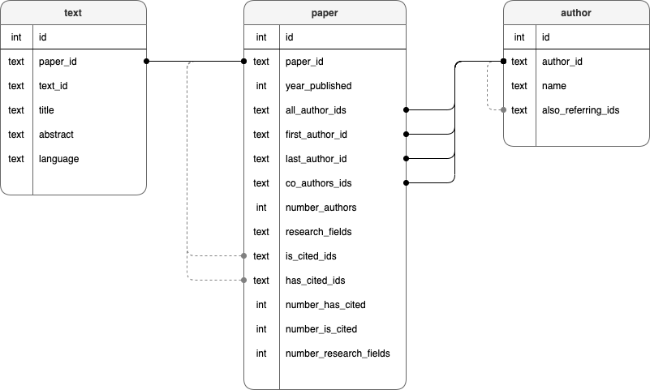

# scholar-data-digest
Request and digest data of academic papers into a postgreSQL database instance.    

Right now, this is limited to data from [Semantic Scholar](https://www.semanticscholar.org/).    
See also:
- http://s2-public-api-prod.us-west-2.elasticbeanstalk.com/corpus/
- https://api.semanticscholar.org/    


## Install

### Prerequisite
- sudo pip3 install black
- sudo pip3 install poetry
- in case of docker problems, try: docker --> preferences --> allowcate more memory

### Build and start container (API and PostgreSQL DB)
```
$ docker-compose up --build
```

Both the Rest API and the postgreSQL database should be running after the building process. (his may take a while.)    

Right now, following ports are used:
- API: localhost:8080
- DB: localhost:5432

(You can change the ports in docker-compose.yml)


## Usage

### Bulk ingest
Semantic Scholar offers a bulk download divided into around 6000 batches with 30000 JSON line entries each.
To digest these files, it is assumed that you download and decrompress the files of interest into some data directory. All files passed by Rest API method call will be digested into the database instance named "scholar".

See chapter "Methods" below on how to initiate the process.    

See:
- http://s2-public-api-prod.us-west-2.elasticbeanstalk.com/corpus/
- http://s2-public-api-prod.us-west-2.elasticbeanstalk.com/corpus/download/

Getting files with curl (i.e. for OSX user):
- get the manifest.txt file
```
$ curl -O https://s3-us-west-2.amazonaws.com/ai2-s2-research-public/open-corpus/2020-11-06/manifest.txt
```
- get individual files from manifest.txt listing (stringly recommended)
```
$ curl -O https://s3-us-west-2.amazonaws.com/ai2-s2-research-public/open-corpus/2020-11-06/s2-corpus-000.gz
```


### Semantic Scholar JSON
Check out [JSON example](readme_files/semantic_scholar_corpus_entry_example.json) from corpus download.

### Database schema
(

### Methods